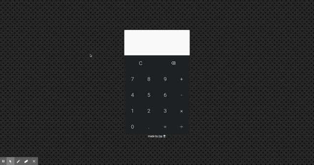

## Calculadora com JavaScript

Uma calculadora que suporta operações simples com javascript;

Desenvolvida para a disciplina de **Programação para internet 2**

<h2 align="center">Layout demo</h2>

    

