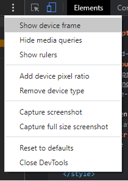
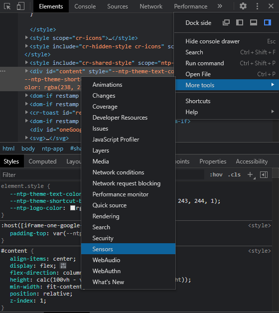

## Console log tricks and types

Some types of `console.log` for help to debug

## Chrome devtools:

- In Chrome devtools we can preserve log, checking the checkbox on `Console settings > Preserve log`
- In Chrome devtools we can get the previous used command with `$_`
- In Chrome devtools we can get the last selected elements with `$0`, `$1`, `$2`, `$3` or `$4`
- In Chrome devtools we can get the a object on our project with `$('your-element')`, obs: this command is overwrited if you have jquery in our project
- In Chrome devtools we can get the all objects on our project with `$$('your-element')`
- In Chrome devtools we can get all the event listeners on a element `getEventListener(element)`
- For use Chrome to edit our files, we can click with the right button in `index.html` then select the option `Map to Network Resource` and select the `index.html`, with this we can use Devtools like our IDE or code editor
- To remove the map network resource from Devtools, only click with the right button on `index.html` and select the option `Remove Networking Mapping` then remove the folder `devTools` in `source` tab, `right click` + `Remove folder from workspace`
- **Pretty print:** Open the source code in the Source tab and click on the `{}` icon, by clicking on `{}` DevTools identified the code for us! Now we can leave the performance optimized and still be able to read it in the browser
- In Chrome devtools we can add a frame of a mobile device
  - 
- In the option more tools > sensors we can access useful tools for change our geolocation for dev testing
  - 

### Memory/Profiles tab

In this tab we can check, the performance of your application, checking if our js scripts are fine and not too heavy on the user browser

### Performance tab

In this tab pressing `ctrl + e` we can record all the animations and check all the time it took to finish
