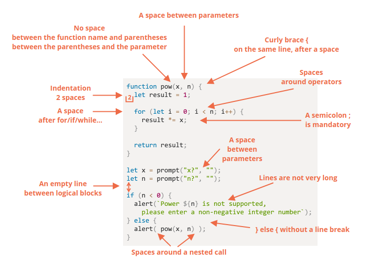

## Code quality

### Debbuging

Paused on breakpoint

- **Watch – shows current values for any expressions.**
  - You can click the plus + and input an expression. The debugger will show its value at any moment, automatically recalculating it in the process of execution.
- **Call Stack – shows the nested calls chain.**

  - At the current moment the debugger is inside hello() call, called by a script in index.html (no function there, so it’s called “anonymous”).
    If you click on a stack item (e.g. “anonymous”), the debugger jumps to the corresponding code, and all its variables can be examined as well.

- **Scope – current variables.**
  - Local shows local function variables. You can also see their values highlighted right over the source.
    Global has global variables (out of any functions).

#### Tracing the execution

- :arrow_forward: **“Resume”: continue the execution (hotkey F8)**
  - Resumes the execution. If there are no additional breakpoints, then the execution just continues and the debugger loses control.
- :arrow_right: **“Step”: run the next command (hotkey F9)**
  - Run the next statement. Clicking this again and again will step through all script statements one by one.
- :arrow_heading_down: **“Step over”: run the next command, but don’t go into a function (hotkey F10)**
  - Similar to the previous the “Step” command, but behaves differently if the next statement is a function call. That is: not a built-in, like alert, but a function of our own. The “Step” command goes into it and pauses the execution at its first line, while “Step over” executes the nested function call invisibly, skipping the function internals. The execution is then paused immediately after that function. That’s good if we’re not interested to see what happens inside the function call.
- :arrow_down: **“Step into” (hotkey F11)**
  - That’s similar to “Step”, but behaves differently in case of asynchronous function calls. _“Step” command ignores async actions_
- :arrow_up: **“Step out”: continue the execution till the end of the current function, (hotkey Shift+F11)**
  - Continue the execution and stop it at the very last line of the current function. That’s handy when we accidentally entered a nested call using :arrow_right:, but it does not interest us, and we want to continue to its end as soon as possible.
- :no_entry_sign: **enable/disable all breakpoints**
  - That button does not move the execution. Just a mass on/off for breakpoints.
- :warning: **enable/disable automatic pause in case of an error**
  - When enabled, and the developer tools is open, a script error automatically pauses the execution. Then we can analyze variables to see what went wrong. So if our script dies with an error, we can open debugger, enable this option and reload the page to see where it dies and what’s the context at that moment.

### Coding Style



> :warning: There are no “you must” rules
> Nothing is set in stone here. These are style preferences, not religious dogmas.

#### Curly Braces

1. 😏 One line without braces – acceptable, if it’s short:
   `if (n < 0) alert(`Power ${n} is not supported`);`
2. 😃 The best variant:
   ```
   if (n < 0) {
     alert(`Power ${n} is not supported`);
   }
   ```

#### Line Length

The maximum line length should be agreed upon at the team-level. It's usually 80 or 120 characters.

#### Indents

- Horizontal indents: 2 or 4 spaces;
- Verticial indents: empty lines for splitting code into logical blocks

#### Nesting Levels

For avoiding nesting code too many levels deep.

For example, in the loop, it's sometimes a good ideia to use the `continue` directive to avoid extra nesting.

example:

```
for (let i = 0; i < 10; i++) {
  if (cond) {
    ... // <- one more nesting level
  }
}

We can write:

for (let i = 0; i < 10; i++) {
  if (!cond) continue;
  ...  // <- no extra nesting level
}
```

Other example for reduce a nest level

```
function pow(x, n) {
  if (n < 0) {
    alert("Negative 'n' not supported");
  } else {
    let result = 1;

    for (let i = 0; i < n; i++) {
      result *= x;
    }

    return result;
  }
}

function pow(x, n) {
  if (n < 0) {
    alert("Negative 'n' not supported");
    return; <- empty return for prevent nested block
  }

  let result = 1;

  for (let i = 0; i < n; i++) {
    result *= x;
  }

  return result;
}
```

### Style guides

Some useful links about it:

- [Google JavaScript Style Guide](https://google.github.io/styleguide/jsguide.html)
- [Airbnb JavaScript Style Guide](https://github.com/airbnb/javascript)
- [Idiomatic.JS](https://github.com/rwaldron/idiomatic.js)
- [StandardJS](https://standardjs.com/)

### Polyfills and transpilers

The JavaScript language steadily evolves. New proposals to the lang appear regurlarly.

We like to use most recent features but how to make out modern code work on older engines that don't understand recent features yet?

There are two tools for that:

1. Transpilers
2. Polyfills

#### Transpilers

A transpiler is a special piece of software that can parse modern code, and rewrite it using older syntax constructs, so that the result would be the same.

```
// before running the transpiler
height = height ?? 100;

// after running the transpiler
height = (height !== undefined && height !== null) ? height : 100;
```

Some transpilers:

- [Babel](https://babeljs.io/)
- [webpack](http://webpack.github.io/)

#### Polyfills

New languages features may include not only syntax constructs and operators, but also built-in functions

For example, Math.trunc(n) is a function that “cuts off” the decimal part of a number, e.g Math.trunc(1.23) = 1.

In some (very outdated) JavaScript engines, there’s no Math.trunc, so such code will fail.

As we’re talking about new functions, not syntax changes, there’s no need to transpile anything here. We just need to declare the missing function.

A script that updates/adds new functions is called “polyfill”. It “fills in” the gap and adds missing implementations.

For this particular case, the polyfill for Math.trunc is a script that implements it, like this:

```
if (!Math.trunc) { // if no such function
  // implement it
  Math.trunc = function(number) {
    // Math.ceil and Math.floor exist even in ancient JavaScript engines
    // they are covered later in the tutorial
    return number < 0 ? Math.ceil(number) : Math.floor(number);
  };
}
```

Two libraries of polyfills:

- [core js](https://github.com/zloirock/core-js) that supports a lot, allows to include only needed features.
- [polyfill.io](https://polyfill.io/v3/) service that provides a script with polyfills, depending on the features and user’s browser.
